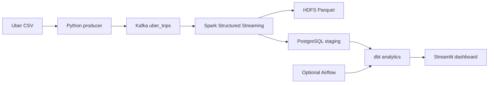

# Uber Big Data Streaming

A local streaming pipeline for the FiveThirtyEight Uber April 2014 pickup dataset. The source contains 564,516 records and the columns `Date/Time`, `Lat`, `Lon`, and `Base`. The producer emits only the supported canonical fields: `trip_id`, `event_timestamp`, `pickup_latitude`, `pickup_longitude`, and `base`.

## Architecture



The core path is Kafka -> Spark -> HDFS plus PostgreSQL. Airflow is optional and only orchestrates the dbt batch workflow. See [docs/ARCHITECTURE.md](docs/ARCHITECTURE.md) for responsibilities and boundaries.

## Prerequisites and environment

The working setup assumes Windows with Java 8, Hadoop 3.3.6, Spark 3.5.9, PostgreSQL 17, Docker Desktop, Git, and Miniconda/Conda already installed. The repository does not install Miniconda, Java, Hadoop, Spark, PostgreSQL, or Docker Desktop.

Copy `.env.example` to `.env` and fill in local values. Never commit `.env` or `airflow/.env`. From Windows PowerShell, load the root environment into the current process without printing it:

```powershell
Get-Content .env | ForEach-Object {
  if ($_ -match '^\s*([^#=][^=]*)=(.*)$') {
    [Environment]::SetEnvironmentVariable($matches[1].Trim(), $matches[2].Trim(), 'Process')
  }
}
```

This loading step is required before host-side `dbt` commands. For the Airflow containers, Compose loads the same file with `env_file: ../.env` and overrides `POSTGRES_HOST` to `host.docker.internal`.

## Reproducible startup order

1. **PowerShell:** clone the repository and copy `.env.example` to `.env`.
2. **PowerShell:** run `./scripts/setup_env.ps1`, then `conda activate bds-uber`.
3. **Git Bash:** download the dataset with `bash scripts/download_dataset.sh`. The CSV remains ignored under `data/raw/`.
4. **Docker:** start the one-broker Kafka KRaft service with `docker compose -f kafka/docker-compose.yml up -d`.
5. **Docker/PowerShell:** create or check topic `uber_trips` with the command in [docs/KAFKA.md](docs/KAFKA.md). The broker is available at `localhost:9092`.
6. **Host:** start the existing Hadoop/HDFS services and verify PostgreSQL 17 is running with database `uber_streaming`.
7. **Spark:** start Structured Streaming with the command below. It writes both HDFS and PostgreSQL.
8. **PowerShell:** run the producer with the command below. The default demo sends 10 events every 10 seconds and persists its position in `data/producer_state.json`. Streamlit refreshes its dashboard fragment every 10 seconds.
9. **Host:** verify HDFS output and PostgreSQL `staging.uber_trips` using the existing local tools.
10. **PowerShell:** load `.env`, then run `dbt deps`, `dbt run --profiles-dir .`, and `dbt test --profiles-dir .` from `dbt/`.
11. **Docker:** start optional Airflow from `airflow/`; use [docs/AIRFLOW.md](docs/AIRFLOW.md) for the existing-container and fresh-setup commands.
12. **Airflow UI:** trigger or inspect `uber_pipeline_dbt` and verify `dbt_deps`, `dbt_run`, and `dbt_test`.
13. **PowerShell:** start Streamlit with `streamlit run dashboard/app.py`.

Keep Kafka, Hadoop/HDFS, and Spark running simultaneously for the streaming demo. PostgreSQL must remain available for the JDBC sink. Airflow and Streamlit are separate optional processes for batch orchestration and analytics viewing.

## Quick commands

```bash
python -m producer.uber_producer --batch-size 10 --interval-seconds 10 --limit 100
spark-submit --packages org.apache.spark:spark-sql-kafka-0-10_2.12:3.5.9,org.postgresql:postgresql:42.7.7 spark_streaming/stream_all_events.py
cd dbt && dbt run --profiles-dir . && dbt test --profiles-dir .
streamlit run dashboard/app.py
```

## Commands by responsibility

- **Windows/PowerShell:** `./scripts/setup_env.ps1`; then `conda activate bds-uber`.
- **Docker:** `docker compose -f kafka/docker-compose.yml up -d`.
- **Spark:** run `spark-submit --packages org.apache.spark:spark-sql-kafka-0-10_2.12:3.5.9,org.postgresql:postgresql:42.7.7 spark_streaming/stream_all_events.py` from the repository root.
- **PostgreSQL:** execute `postgres/sql/001_create_schemas.sql`, `002_create_staging_table.sql`, and `003_analytics_views.sql`; for an existing database, also run `004_streaming_resilience.sql` with `psql`.
- **dbt:** from `dbt/`, run `dbt deps`, `dbt run --profiles-dir .`, and `dbt test --profiles-dir .`.
- **Airflow:** optional; from `airflow/`, run `docker compose --env-file ../.env up airflow-init` only for a fresh metadata volume, then `docker compose --env-file ../.env up -d`.

The actual dataset is downloaded at runtime and ignored by Git. No credentials or unsupported Uber fields are included.

## Verified results

These results were manually verified in the working Windows setup:

- Dataset processed: 564,516 records.
- PostgreSQL: `staging.uber_trips` contains 564,516 rows.
- dbt: the staging, fact, KPI, time, base, day-type, heatmap, base-hour, and geographic analytics models are built and tested.
- dbt tests: 12/12 passed.
- Airflow: `dbt_deps`, `dbt_run`, and `dbt_test` succeeded.
- Streamlit: dashboard displays the PostgreSQL analytics.


## Streaming demo behavior

The producer is intentionally restart-safe for the live demonstration:

- Default batch size: 10 events.
- Default interval: 10 seconds between batches.
- Producer position is stored in `data/producer_state.json`, which is ignored by Git.
- Kafka uses `acks=all` and retries.
- PostgreSQL loads through `staging.uber_trips_ingest` and merges with `ON CONFLICT DO NOTHING`, so replayed Kafka events do not fail the primary-key boundary.
- Spark derives dates/hours using `America/New_York`, matching the source dataset's local pickup timestamps.
- HDFS remains the append-oriented processed-data lake; PostgreSQL is the idempotent serving boundary.

Do not reset the producer state or Kafka topic while a previous Spark checkpoint is still being reused unless you intentionally want to replay the same events. For a clean isolated demonstration, use a fresh topic/checkpoint/output path rather than deleting existing project data.

## Dashboard metrics

The dashboard is deliberately limited to fields supported by the source data. It includes total trips, active bases, average/median daily trips, busiest and quietest hours, peak-hour share, weekday/weekend split, time-of-day distribution, daily percentage change, seven-day rolling average, day-by-hour activity, base/hour analysis, geographic grid density, duplicate/coordinate quality checks, and Spark batch metrics. It does not invent fare, distance, duration, passenger, payment, or revenue fields because those columns are not present in the FiveThirtyEight dataset.

## Technology responsibilities

- Python and Kafka: deterministic event conversion and delivery.
- Spark Structured Streaming: JSON parsing, validation, New York local-time enrichment, checkpointed Parquet writes, and idempotent PostgreSQL batch loading.
- HDFS: processed data-lake storage.
- PostgreSQL: durable staging table, idempotent ingest boundary, and streaming batch metrics.
- dbt: documented analytical models and data-quality tests.
- Streamlit: PostgreSQL-backed KPI, time, base, geographic, data-quality, and streaming-health exploration.
- Airflow: optional scheduled dbt orchestration only.

## Academic project framing

This project illustrates a complete local big-data streaming architecture, including an immutable event contract, stream processing, partitioned lake storage, warehouse-style modeling, quality checks, and visualization. Infrastructure provisioning and performance benchmarking are intentionally outside the repository scope.

## Development phases

1. **Application cleanup:** producer, Kafka, Spark, HDFS, PostgreSQL, dbt, and Streamlit.
2. **Docker infrastructure:** Kafka Docker and optional Airflow Docker.
3. **End-to-end local testing:** producer -> Kafka -> Spark -> HDFS/PostgreSQL -> dbt -> dashboard.
4. **Future three-node cluster:** one NameNode/Spark Master/Kafka node and two DataNode/Spark Worker nodes. This phase is intentionally deferred.
5. **Airflow orchestration:** optional Docker Airflow for batch/dbt workflow.
