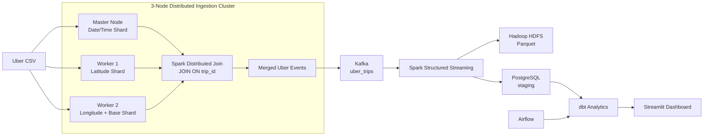

# Uber Big Data Streaming

A local big-data streaming pipeline for the FiveThirtyEight Uber April 2014 pickup dataset. The source contains 564,516 records and the columns `Date/Time`, `Lat`, `Lon`, and `Base`.

The project implements a distributed ingestion layer using a 3-node Hadoop/Spark cluster. The source dataset is divided column-wise across the cluster, where each shard contains a common `trip_id`. Spark performs a distributed join on `trip_id` to reconstruct complete Uber events before they enter the Kafka streaming pipeline.

The producer emits only the supported canonical fields:

`trip_id`, `event_timestamp`, `pickup_latitude`, `pickup_longitude`, and `base`.

## Architecture



## Distributed Ingestion

The source dataset is divided into three column-wise shards:

```text
Master Node
    trip_id + Date/Time

Worker 1
    trip_id + Lat

Worker 2
    trip_id + Lon + Base
```

Each record uses the same deterministic `trip_id`.

Spark performs a distributed join:

```text
Date/Time Shard
       \
        \
Latitude Shard ----> JOIN ON trip_id ----> Complete Uber Event
        /
       /
Lon + Base Shard
```

The resulting canonical event is:

```json
{
  "trip_id": "uber-3d7b142f0c24e77ba450",
  "event_timestamp": "2014-04-01T00:11:00+00:00",
  "pickup_latitude": 40.769,
  "pickup_longitude": -73.9549,
  "base": "B02512"
}
```

The distributed ingestion stage supports a controlled streaming demonstration:

- First 50,000 records are processed immediately.
- Remaining records are emitted at 20 records every 10 seconds.
- Complete events are then passed into the Kafka streaming pipeline.

The distributed ingestion layer is responsible for reconstructing complete events from distributed source shards. Kafka and Spark Structured Streaming handle the downstream event-streaming and processing stages.

See `docs/ARCHITECTURE.md` for responsibilities and boundaries.

## Prerequisites and Environment

The working setup assumes Windows with:

- Java 8
- Hadoop 3.3.6
- Spark 3.5.9
- PostgreSQL 17
- Docker Desktop
- Git
- Miniconda/Conda

The repository does not install Miniconda, Java, Hadoop, Spark, PostgreSQL, or Docker Desktop.

Copy `.env.example` to `.env` and fill in local values.

Never commit `.env` or `airflow/.env`.

From Windows PowerShell, load the root environment into the current process without printing it:

```powershell
Get-Content .env | ForEach-Object {
  if ($_ -match '^\s*([^#=][^=]*)=(.*)$') {
    [Environment]::SetEnvironmentVariable($matches[1].Trim(), $matches[2].Trim(), 'Process')
  }
}
```

This loading step is required before host-side `dbt` commands.

For the Airflow containers, Compose loads the same file with:

```yaml
env_file: ../.env
```

and overrides `POSTGRES_HOST` to:

```text
host.docker.internal
```

## Reproducible Startup Order

### 1. Clone the Repository

```powershell
git clone <repository-url>
cd BDS_robust_dashboard
```

Copy `.env.example` to `.env`.

### 2. Activate the Environment

```powershell
./scripts/setup_env.ps1
conda activate bds-uber
```

### 3. Download the Dataset

From Git Bash:

```bash
bash scripts/download_dataset.sh
```

The CSV remains ignored under `data/raw/`.

### 4. Start the Distributed Hadoop/Spark Cluster

The project uses a 3-node logical cluster:

```text
Master Node
├── Hadoop NameNode
└── Spark Master

Worker 1
├── Hadoop DataNode
└── Spark Worker

Worker 2
├── Hadoop DataNode
└── Spark Worker
```

Start the cluster services using the scripts under:

```text
scripts/
```

Verify HDFS:

```powershell
hdfs dfsadmin -report
```

The cluster should show two live DataNodes.

Verify the Spark Master UI and confirm that both Spark Workers are registered.

### 5. Run Distributed Ingestion

The distributed ingestion stage reads the three HDFS shards:

```text
/data/uber/cluster_input/master_datetime.csv
/data/uber/cluster_input/worker1_lat.csv
/data/uber/cluster_input/worker2_lon_base.csv
```

Spark performs the distributed join on `trip_id`.

The merged dataset is written to:

```text
/data/uber/cluster_merged
```

Run the distributed ingestion job:

```powershell
spark-submit `
  --master spark://localhost:7077 `
  distributed_ingestion/cluster_distributed_stream.py
```

The demonstration starts with:

```text
50,000 records immediately
```

and then continues with:

```text
20 records every 10 seconds
```

### 6. Start Kafka

Start the one-broker Kafka KRaft service:

```powershell
docker compose -f kafka/docker-compose.yml up -d
```

Create or verify the `uber_trips` topic using the commands in `docs/KAFKA.md`.

The broker is available at:

```text
localhost:9092
```

### 7. Start Spark Structured Streaming

Run:

```powershell
spark-submit `
  --packages org.apache.spark:spark-sql-kafka-0-10_2.12:3.5.9,org.postgresql:postgresql:42.7.7 `
  spark_streaming/stream_all_events.py
```

Spark consumes the complete events from Kafka and writes them to both HDFS and PostgreSQL.

### 8. Start PostgreSQL

PostgreSQL 17 must be running with database:

```text
uber_streaming
```

The database contains the staging and analytics layers used by the project.

### 9. Run dbt

From the `dbt/` directory:

```powershell
dbt deps
dbt run --profiles-dir .
dbt test --profiles-dir .
```

dbt transforms PostgreSQL staging data into analytics-ready models and performs data-quality tests.

### 10. Start Airflow

Airflow is used as the orchestration layer for the dbt workflow.

For a fresh metadata volume:

```powershell
cd airflow
docker compose --env-file ../.env up airflow-init
```

Then:

```powershell
docker compose --env-file ../.env up -d
```

The Airflow DAG:

```text
uber_pipeline_dbt
```

orchestrates:

```text
dbt run
   ↓
dbt test
```

Airflow is an orchestration component and does not replace Kafka or Spark in the streaming path.

### 11. Start Streamlit

```powershell
streamlit run dashboard/app.py
```

The dashboard reads the analytics data from PostgreSQL.

## Quick Commands

### Check HDFS Cluster

```powershell
hdfs dfsadmin -report
```

### Distributed Ingestion

```powershell
spark-submit `
  --master spark://localhost:7077 `
  distributed_ingestion/cluster_distributed_stream.py
```

### Kafka

```powershell
docker compose -f kafka/docker-compose.yml up -d
```

### Spark Structured Streaming

```powershell
spark-submit `
  --packages org.apache.spark:spark-sql-kafka-0-10_2.12:3.5.9,org.postgresql:postgresql:42.7.7 `
  spark_streaming/stream_all_events.py
```

### dbt

```powershell
cd dbt
dbt run --profiles-dir .
dbt test --profiles-dir .
```

### Streamlit

```powershell
streamlit run dashboard/app.py
```

## Commands by Responsibility

- **Distributed ingestion:** Hadoop HDFS + Spark standalone cluster.
- **Python:** deterministic event preparation and distributed ingestion logic.
- **Kafka:** event/message streaming.
- **Spark Structured Streaming:** JSON parsing, validation, local-time enrichment, checkpointed Parquet writes, and PostgreSQL batch loading.
- **HDFS:** distributed data-lake storage.
- **PostgreSQL:** durable staging table, idempotent ingest boundary, and streaming batch metrics.
- **dbt:** SQL-based analytical transformations and data-quality tests.
- **Airflow:** orchestration of the dbt workflow.
- **Streamlit:** PostgreSQL-backed analytics dashboard.
- **Docker:** Kafka and Airflow containerization.

## Verified Results

The working setup was manually verified with:

- Dataset processed: **564,516 records**
- PostgreSQL staging: **564,516 rows**
- dbt analytical models successfully built
- dbt tests: **12/12 passed**
- Airflow dbt workflow successfully executed
- Streamlit dashboard successfully displays PostgreSQL analytics
- Hadoop cluster: **1 NameNode + 2 DataNodes**
- Spark cluster: **1 Master + 2 Workers**
- Distributed ingestion successfully reconstructs complete events by joining the three source shards on `trip_id`
- HDFS stores the distributed merged dataset as Parquet

## Streaming Demo Behavior

The distributed ingestion stage supports the controlled demonstration:

- **50,000 records** are processed as an initial head-start.
- Remaining records are emitted at **20 records every 10 seconds**.
- The complete event contract remains:
  - `trip_id`
  - `event_timestamp`
  - `pickup_latitude`
  - `pickup_longitude`
  - `base`

The downstream Kafka → Spark Structured Streaming pipeline consumes these complete events.

The streaming pipeline is restart-safe, with Kafka acknowledgements, Spark checkpoints, and PostgreSQL idempotency preventing duplicate primary-key inserts.

For a clean isolated demonstration, use a fresh topic, checkpoint, or output path rather than deleting existing project data.

## Dashboard Metrics

The dashboard is deliberately limited to fields supported by the source data.

It includes:

- Total trips
- Active bases
- Average and median daily trips
- Busiest and quietest hours
- Peak-hour share
- Weekday/weekend split
- Time-of-day distribution
- Daily percentage change
- Seven-day rolling average
- Day-by-hour activity
- Base/hour analysis
- Geographic grid density
- Coordinate-quality checks
- Duplicate checks
- Spark batch metrics
- Streaming health information

The project does not invent fare, distance, duration, passenger, payment, driver, or revenue fields because those columns are not present in the FiveThirtyEight Uber dataset.

## Technology Responsibilities

### Distributed Ingestion Cluster

The 3-node Hadoop/Spark cluster demonstrates distributed processing and storage:

```text
                    Master Node
                    /          \
             NameNode        Spark Master
                 |                |
                 |        +-------+-------+
                 |        |               |
             Worker 1                 Worker 2
             DataNode                 DataNode
             Spark Worker             Spark Worker
```

The source data is distributed column-wise across the nodes:

```text
Master:
trip_id + Date/Time

Worker 1:
trip_id + Lat

Worker 2:
trip_id + Lon + Base
```

Spark reconstructs complete events by performing a distributed join on `trip_id`.

### Kafka

Kafka acts as the event-streaming layer between distributed ingestion and Spark Structured Streaming.

### Spark Structured Streaming

Spark consumes Kafka events, validates and enriches them, and writes the processed data to HDFS and PostgreSQL.

### HDFS

HDFS provides distributed storage for processed event data.

### PostgreSQL

PostgreSQL provides the durable relational staging and serving layer.

### dbt

dbt converts PostgreSQL staging data into analytical models and performs data-quality testing.

### Airflow

Airflow orchestrates the recurring dbt workflow.

### Streamlit

Streamlit provides the final analytics dashboard.

## Academic Project Framing

This project demonstrates a complete local big-data architecture combining:

```text
Distributed Ingestion
        ↓
HDFS + Spark Cluster
        ↓
Kafka Event Streaming
        ↓
Spark Structured Streaming
        ↓
HDFS + PostgreSQL
        ↓
dbt Analytics
        ↓
Streamlit Dashboard
```

The architecture demonstrates:

- Distributed storage
- Distributed processing
- Distributed data ingestion
- Event streaming
- Stream processing
- SQL-based analytical transformation
- Data-quality validation
- Workflow orchestration
- Dashboard visualization

The project uses technologies from the Hadoop/Spark big-data ecosystem while keeping the complete workflow reproducible on a local Windows environment.

Infrastructure provisioning and large-scale performance benchmarking are outside the repository scope.

## Development Phases

1. **Application cleanup:** producer, Kafka, Spark, HDFS, PostgreSQL, dbt, and Streamlit.
2. **Docker infrastructure:** Kafka Docker and optional Airflow Docker.
3. **End-to-end local testing:** distributed ingestion → Kafka → Spark → HDFS/PostgreSQL → dbt → dashboard.
4. **Three-node distributed cluster:** one Master node and two Worker nodes with HDFS and Spark services.
5. **Distributed ingestion:** column-wise source shards stored in HDFS and joined using Spark on `trip_id`.
6. **Controlled streaming demonstration:** 50,000-record head-start followed by 20 records every 10 seconds.
7. **Kafka integration:** complete events from the distributed ingestion layer are passed into the existing Kafka topic.
8. **Streaming processing:** Spark Structured Streaming consumes Kafka events and writes to HDFS and PostgreSQL.
9. **Analytics layer:** dbt models and data-quality tests.
10. **Orchestration:** Airflow executes the dbt workflow.
11. **Visualization:** Streamlit provides the final analytics dashboard.
```
