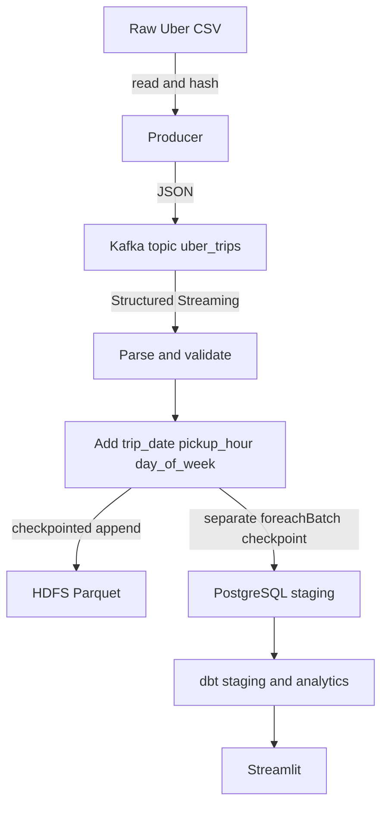

# Architecture

The stream is the core. HDFS and PostgreSQL are independent sinks of the same transformed stream; Airflow is not required for ingestion. Only source-supported fields and documented time derivations are retained.
