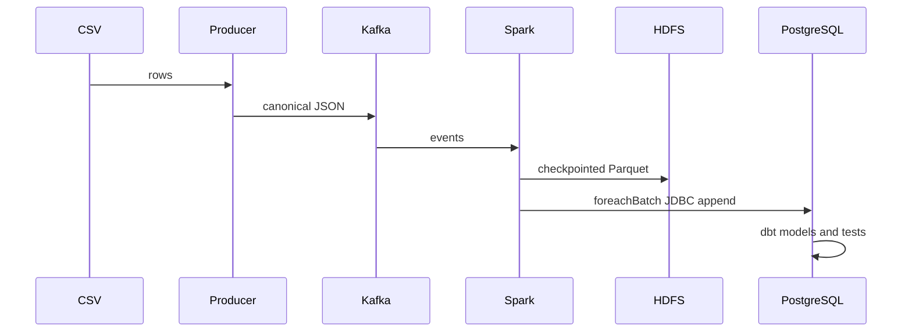

# Project Report

## Objective

Build a local Uber pickup streaming system that demonstrates event ingestion, distributed stream processing, data-lake storage, relational analytics, modeling, quality checks, and visualization.

## Data flow

The reproducible FiveThirtyEight April 2014 CSV is the only source. A Python producer creates deterministic canonical events. Kafka provides the event transport. Spark parses and validates JSON once, then writes checkpointed, partitioned HDFS Parquet and checkpointed PostgreSQL micro-batches through two independent sinks. dbt creates documented analytical relations and tests. Streamlit provides human-readable metrics.

## Design decisions

The design deliberately avoids unsupported attributes and extra infrastructure. Airflow remains optional because it adds scheduling, not stream correctness. Environment variables hold all connection details. The focused tests protect the event contract and malformed input behavior.

